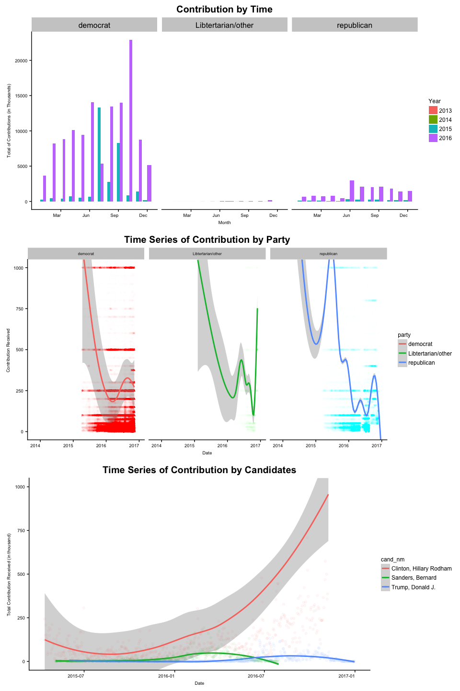
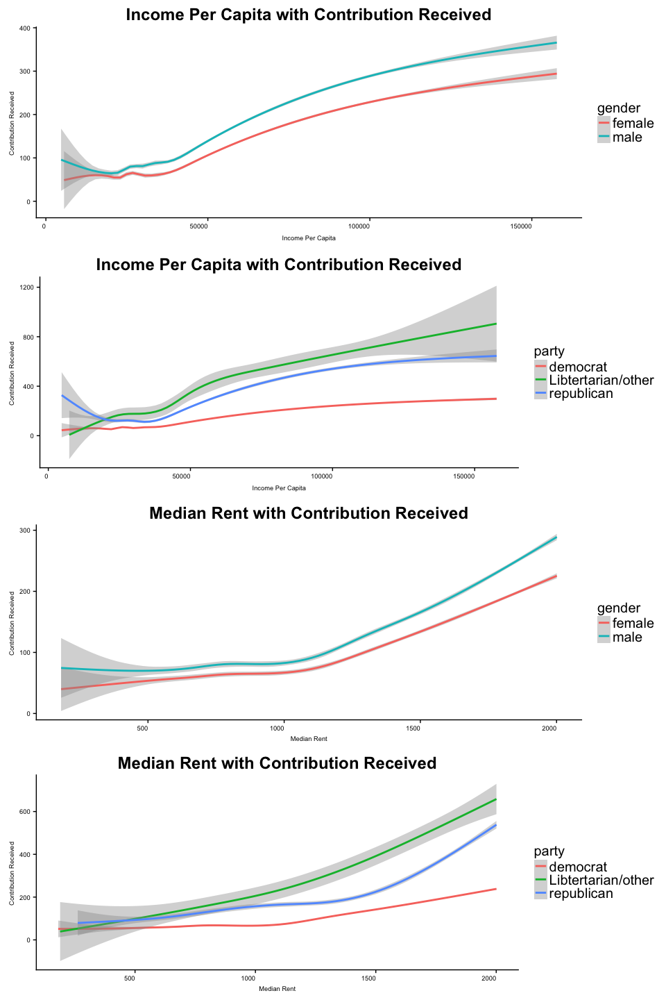
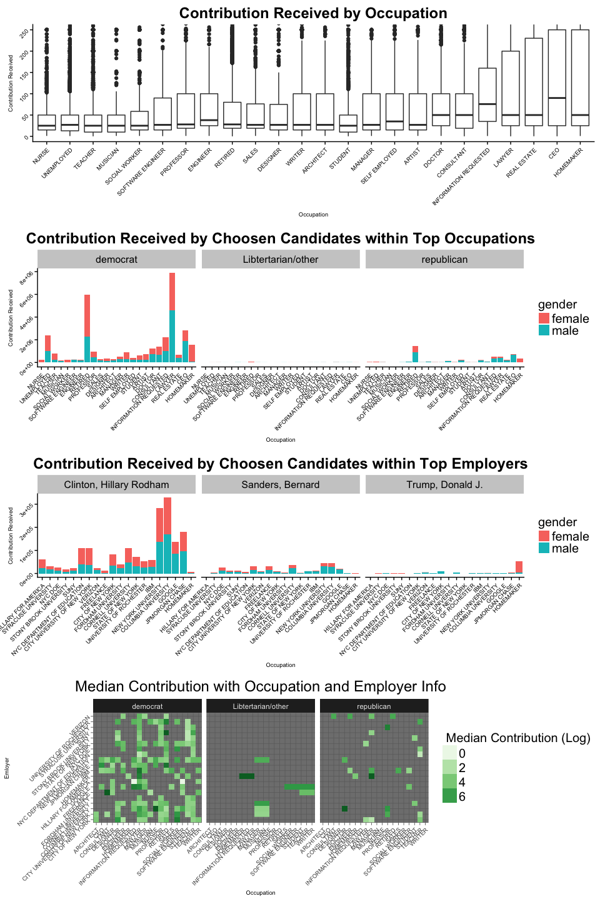

# Financial-Data-Exploration-on-2016-President-Campaign-in-NY
======================================================================
by RUI ZHANG December 05,2017

Introduction
------------

This is the data exploration on 2016 US presidential campaign finance contribution in New York state. The dataset is available at http://classic.fec.gov/disclosurep/pnational.do, which includes the financial information disclosed by each presidential candidates for their campaign and all the individual donations that were over $100,000.

In 2016 presidential campaign, the result unexpectedly brings Trump into White House, and Hilary missed the chance to be the first female president in the US. When people naturally assumed they would see a female president next morning, this reversal astonished Americans without clues. So, what if we have the financial campaign data? What can we get from the dataset? I will explore the nature of campaign contributions and see if there are any interesting relationships in the data, such as: - Which party and candidates got the most support? - What's the difference between different parties' supporters? - How are the donations distributed spatially? - Is there any model that we could build and bring some predictions?

Final Plots and Summary
-----------------------

### Plot One

    ## # A tibble: 4,665 x 7
    ## # Groups:   cand_nm, date [4,665]
    ##      cand_nm       date      party median_date average_date sum_date
    ##       <fctr>     <date>     <fctr>       <dbl>        <dbl>    <dbl>
    ##  1 Bush, Jeb 2015-06-15 republican        2700     2280.952    47900
    ##  2 Bush, Jeb 2015-06-16 republican         750     1233.333     7400
    ##  3 Bush, Jeb 2015-06-17 republican        2700     2665.000    53300
    ##  4 Bush, Jeb 2015-06-18 republican        2700     2705.000    54100
    ##  5 Bush, Jeb 2015-06-19 republican        2700     2562.162    94800
    ##  6 Bush, Jeb 2015-06-20 republican        2700     2700.000     2700
    ##  7 Bush, Jeb 2015-06-21 republican        1850     1850.000     3700
    ##  8 Bush, Jeb 2015-06-22 republican        2700     2607.353    88650
    ##  9 Bush, Jeb 2015-06-23 republican        2700     2558.333    76750
    ## 10 Bush, Jeb 2015-06-24 republican        2700     2675.000   117700
    ## # ... with 4,655 more rows, and 1 more variables: count_date <int>

### Description One

As what we could see, the democrat dominate the donations in New York State. In general, the campaign got most donations in 2017, and it seems having the seasonal contribution peak especially after the summer and winter holiday season. All the parties has the second peak in their donation trend, but its occurance is little bit different as the third party came much earlier and the republican came much later. For the top three candidates, we could see Clinton got the huge win in New York State. Sanders and Trump were paralleled in the amount of donations, but trump seems get more donations when approaching to the final call of the election.

### Plot Two

### Description Two

The donator's income level and rent level are positively correlated with the amount of contribution, which is hidden behind the zipcode info they provided. As most donations were from the New York City, it is really hard to identify what's the difference spacially. But exploring those region's demographic info, we could notify that republican supporters were more generous than the democrat supporters, althought democrat supporters dominate the New York Region.

### Plot Three

### Description Three

As we could see, the mainforce in New York State Campaign were CEO, Homemaker, Lawyer, real estate, doctor, and professor. The actively involoved employers were from university, government agency, and several technology companies.

Although different parties have different supporters, they do have specific characteristics when speaking with the career info. For the democrat party, their supporters mostly were from University, and their occupations were more like retired people, CEO, lawyer, homemaker or consultant. For the republican party, their supporters were more from homemakers, self-employed, and they were more like homemakers and retired people.

------------------------------------------------------------------------

Reflection
----------

In this project, I was determined and designed to identify what's the reason behind the donations amount, and what's the difference between the different parties supporters. The most correlated feature with the contribution were party, gender, median rent, income per capita, and the date of the donations. For the difference between different parties' supporters, if a male tend to donate more than average who lives in the region with lower income and lower rent, he is more probably a republican supporter.

For the challenges and difficulties I met,

Data Preprocessing - The original dataset is little bit messy especially relates to the occupation, employer info, and geolocation info. For the geolocation info, I used the zipcode library to clean it and use the zipcode dataset to get the longitude and latitude based on the zipcode info. For the occupation info, I didn't clean and categorize all of them and only focus on the top 25 of them to clean, analysis and plot.

-   The original dataset doesn't contain so many detailed info about the donators except the messy occupation and employer info. So I added gender info based on the prediction over the First name of the donators and other demographic info based on the zipcode, which definitely fulfill our data info and analysis.

Data Visualization - It's really hard to organize the clear ananlytical and logical process before hand. So it takes time to try, to change, to find, to orgnize.

-   In order to visualize the geoinfo on the map, it takes me some time to find a way and visualize it. Still might not that clear about this part.

-   In order to output the pretty nice graph,the size of the output, the text size, the legend format all take me some time to explore.

Data Modelling - The plotting sometimes is not the direct way to find the relationship between variables. So I spent time to extract the info from the plot as well as try to identify the relationship based on the statistics method.

-   As the occupation and employer info I didn't clean them up, so that they are not used in my logistic regression model.

For the success,

-   Successfully clean up the zipcode and add geolocation info by zipcode dataset.
-   Successfully predict the gender info based on the first name by the gender library.
-   Adding more demographic info through the zipcode by thedf\_zip\_demographics dataset.
-   Visualize various data with geom\_bar,geom\_jitter, geom\_smooth, geom\_raster, geom\_density, geom\_density2,geom\_boxplot, and facet\_wrap method. Also try to plot the info and visualize it on the map.
-   Set up the logistics model with 0.86 accuracy.

Conclusion

By analyzing the financial campaign dataset, here are several intersting results that I found, - New York State were domiated by democrat supporters, who are retired people or professor in the university, Lawyer, homemaker, and doctors. - Hillary got the most donations, followed by Bernard, and Trump. - Female donators were little bit more in the democrat supporters, and males definitely dominate the republican donations. - In general, republican supporters were more generous and donated more than democrat if their income level is same. - Party, income level, rent level, and gender info impact how much money people would love to donate. Also, time is very important, as more people would love to donate in the period after the holiday seasons. - For democrat and republican supporters, they do have different characterics, especially with their career info. Homemaker is a huge part in the Trump donations, and university is the key in Hillary donations.

Shortcomings

-   Not all the people get the predicted genders, which were removed from the analysis.
-   Didn't clean up the career info, which were not included in the modelling.
-   Although I plot the info on the map, but it didn't play the role to reveal that much useful info.

Future

-   As the map didn't play that importance in the analysis or reveal that much info, there might be a way to do some spatial analysis, which would be useful for us to spatially identify how those info were impacted with each other.
-   It would be really intersting to analyze a swing state, and the national campaign finance dataset, which might would help us to identify the reason behind the Trump's success.

